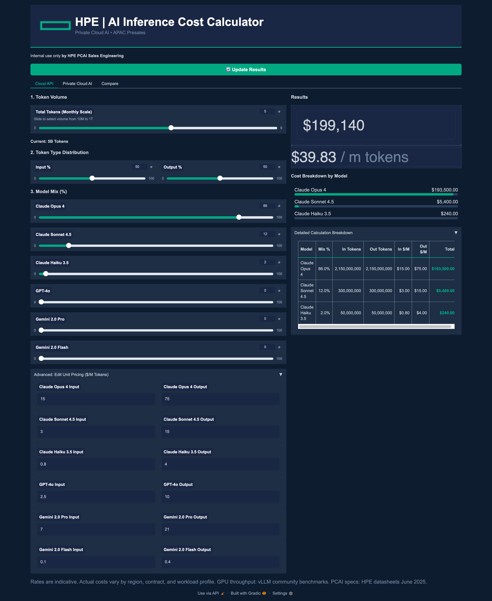
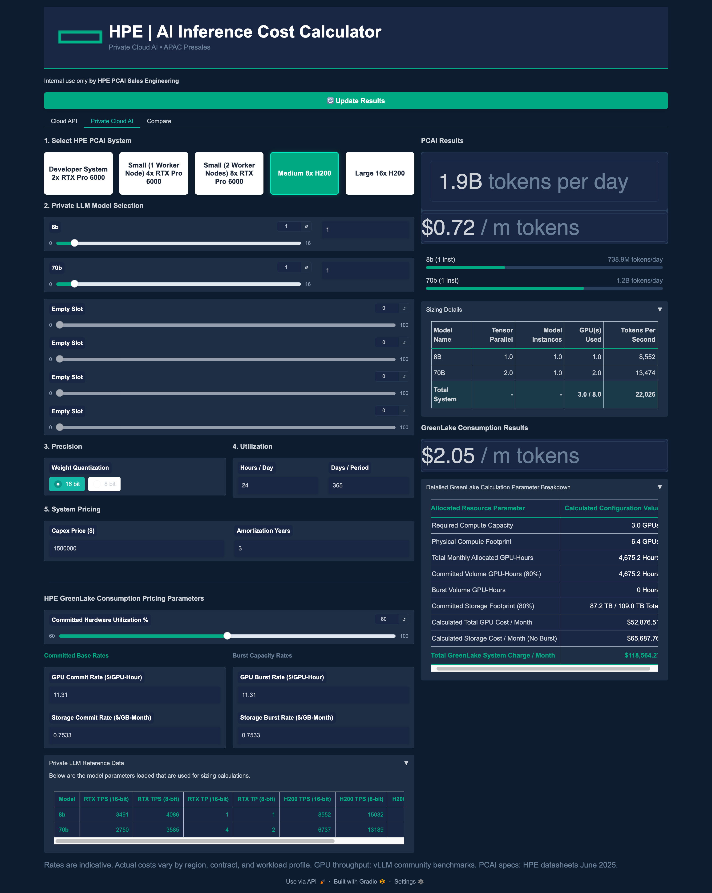
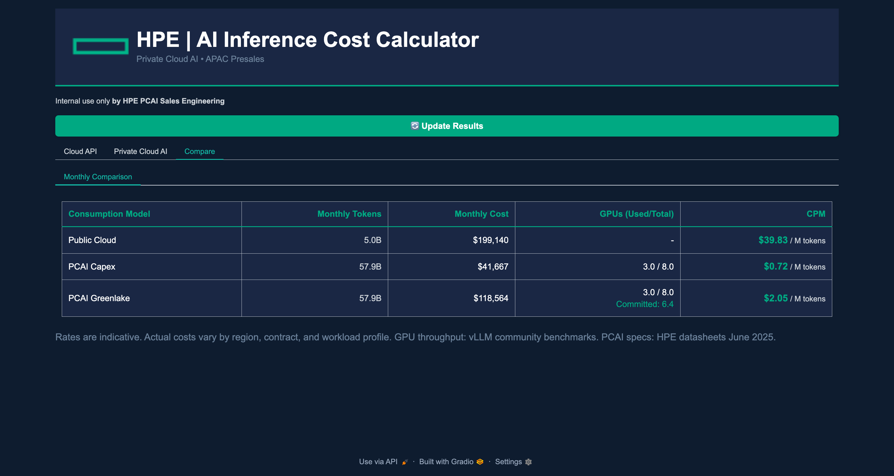

# HPE AI Inference Cost Calculator

This tool is designed for HPE PCAI Sales Engineering to estimate and compare the costs of running AI inference workloads across different consumption models. It allows users to model token volume, distribution, and infrastructure requirements to determine the most cost-effective path for their AI deployment.

## Features

The calculator provides three main modes of analysis:

* **Cloud API:** Estimate costs for public LLM providers based on token volume and model mix.
* **Private Cloud AI:** Calculate infrastructure sizing and costs for private deployments on HPE systems (Capex vs. GreenLake).
* **Comparison:** A side-by-side view to visualize the cost-per-million-tokens (CPM) efficiency between public and private options.

---

## Screenshots

### 1. Public Cloud API Estimation
Used to benchmark costs against public LLM providers.

### 2. Private Cloud AI (PCAI) Sizing
Used to configure HPE infrastructure, quantization settings, and utilization parameters.

### 3. Cost Comparison
Summary view comparing monthly costs and CPM across all models.

---

## Getting Started
*This tool is built with [Gradio](https://www.gradio.app/).*

To run this calculator locally:

1. Clone the repository.
2. Install dependencies: `pip install -r requirements.txt`
3. Launch the app: `python app.py`

*Internal use only by HPE PCAI Sales Engineering.*